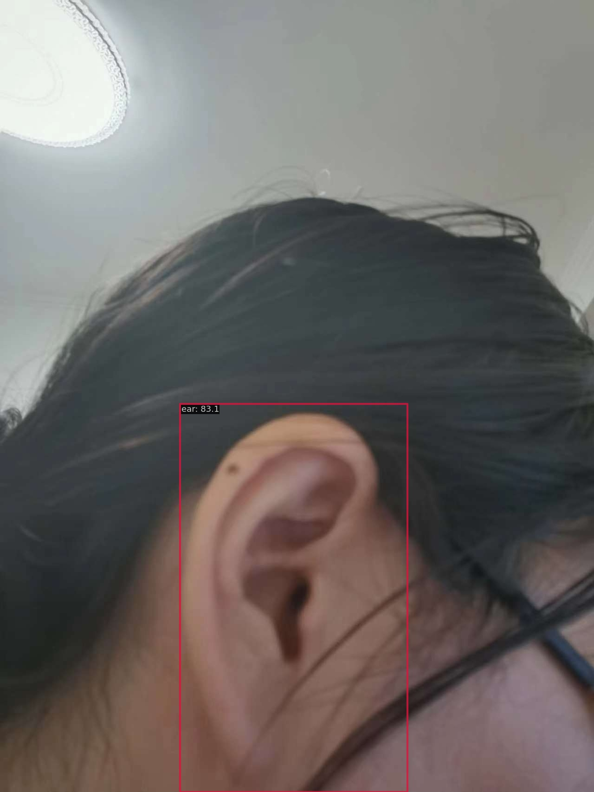
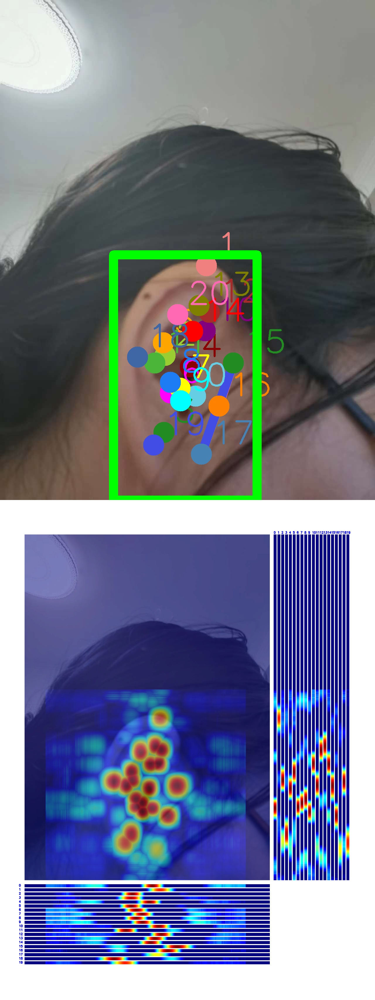

# 2023OpenMMLabCamp2
Second AI Camp (online) of OpenMMLab

## rtmdet result

 Average Precision  (AP) @[ IoU=0.50:0.95 | area=   all | maxDets=100 ] = 0.822
 Average Precision  (AP) @[ IoU=0.50      | area=   all | maxDets=100 ] = 0.970
 Average Precision  (AP) @[ IoU=0.75      | area=   all | maxDets=100 ] = 0.970
 Average Precision  (AP) @[ IoU=0.50:0.95 | area= small | maxDets=100 ] = -1.000
 Average Precision  (AP) @[ IoU=0.50:0.95 | area=medium | maxDets=100 ] = -1.000
 Average Precision  (AP) @[ IoU=0.50:0.95 | area= large | maxDets=100 ] = 0.822
 Average Recall     (AR) @[ IoU=0.50:0.95 | area=   all | maxDets=  1 ] = 0.857
 Average Recall     (AR) @[ IoU=0.50:0.95 | area=   all | maxDets= 10 ] = 0.857
 Average Recall     (AR) @[ IoU=0.50:0.95 | area=   all | maxDets=100 ] = 0.857
 Average Recall     (AR) @[ IoU=0.50:0.95 | area= small | maxDets=100 ] = -1.000
 Average Recall     (AR) @[ IoU=0.50:0.95 | area=medium | maxDets=100 ] = -1.000
 Average Recall     (AR) @[ IoU=0.50:0.95 | area= large | maxDets=100 ] = 0.857
06/04 23:02:38 - mmengine - INFO - bbox_mAP_copypaste: 0.822 0.970 0.970 -1.000 -1.000 0.822
06/04 23:02:38 - mmengine - INFO - Epoch(test) [6/6]    coco/bbox_mAP: 0.8220  coco/bbox_mAP_50: 0.9700  coco/bbox_mAP_75: 0.9700  coco/bbox_mAP_s: -1.0000  coco/bbox_mAP_m: -1.0000  coco/bbox_mAP_l: 0.8220  data_time: 0.4132  time: 0.6819

## rtmdet output image

## rtmpose result
 Average Precision  (AP) @[ IoU=0.50:0.95 | area=   all | maxDets= 20 ] =  0.753
 Average Precision  (AP) @[ IoU=0.50      | area=   all | maxDets= 20 ] =  1.000
 Average Precision  (AP) @[ IoU=0.75      | area=   all | maxDets= 20 ] =  0.945
 Average Precision  (AP) @[ IoU=0.50:0.95 | area=medium | maxDets= 20 ] = -1.000
 Average Precision  (AP) @[ IoU=0.50:0.95 | area= large | maxDets= 20 ] =  0.753
 Average Recall     (AR) @[ IoU=0.50:0.95 | area=   all | maxDets= 20 ] =  0.781
 Average Recall     (AR) @[ IoU=0.50      | area=   all | maxDets= 20 ] =  1.000
 Average Recall     (AR) @[ IoU=0.75      | area=   all | maxDets= 20 ] =  0.952
 Average Recall     (AR) @[ IoU=0.50:0.95 | area=medium | maxDets= 20 ] = -1.000
 Average Recall     (AR) @[ IoU=0.50:0.95 | area= large | maxDets= 20 ] =  0.781
06/04 23:18:50 - mmengine - INFO - Evaluating PCKAccuracy (normalized by ``"bbox_size"``)...
06/04 23:18:50 - mmengine - INFO - Evaluating AUC...
06/04 23:18:50 - mmengine - INFO - Evaluating NME...
06/04 23:18:50 - mmengine - INFO - Epoch(test) [6/6]    coco/AP: 0.752595  coco/AP .5: 1.000000  coco/AP .75: 0.944699  coco/AP (M): -1.000000  coco/AP (L): 0.752595  coco/AR: 0.780952  coco/AR .5: 1.000000  coco/AR .75: 0.952381  coco/AR (M): -1.000000  coco/AR (L): 0.780952  PCK: 0.973923  AUC: 0.137415  NME: 0.040386  data_time: 0.887532  time: 1.077402

## rtmpose output image

## rtmpose output video
[video](outputs/G2_Video/hw1_video.mp4)

